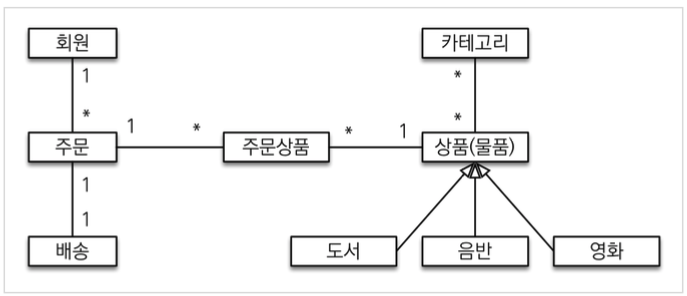
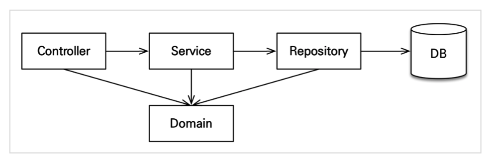

# 실전! 스프링 부트와 JPA 활용1

참고 강의 사이트:https://www.inflearn.com/course/%EC%8A%A4%ED%94%84%EB%A7%81%EB%B6%80%ED%8A%B8-JPA-%ED%99%9C%EC%9A%A9-1/dashboard

프로젝트에서 사용하는 라이브러리

- spring web
- spring data jpa
- thymeleaf
- lombok
- H2 database driver
- spring mc
- spring orm
- JPA, Hibernate

### Thymleaf

**thymeleaf는 템플릿 엔진이다**

- 스프링 부트 thymeleaf viewName 매핑
  - `resources:templates` + {ViewName} + `html`

### 도메인 모델과 테이블 설계

### 애플리케이션 아키텍쳐

### 엔티티 설계 시 주의점

#### 엔티티에는 가급적 Setter를 사용하지 말자

Setter가 모두 열려있으면 변경 포인트가 너무 많아서, 유지보수가 어렵다.

#### 모든 연관관계는 지연로딩으로 설정!

- 즉시로딩(`EAGER`)는 예측이 어렵고, 어떤 SQL이 실행될지 추적하기 어렵다. 특히 JPQL을 실행할 때 N+1 문제가 자주 발생한다.
- 실무에서 모든 연관관계는 지연로딩(`LAZY`)으로 설정해야 한다
- 연관된 엔티티를 함께 DB에서 조회해야 하면, fetch join또는 엔티티 그래프 기능을 사용한다.
- @XToOne(OneToOne, ManyToOne)관계는 기본이 즉시로딩이므로 직접 지연로딩을 설정해야 한다.

#### 컬렉션은 필드에서 초기화 하자.

- 컬렉션은 필드에서 바로 초기화 하는 것이 안전하다.
- `null` 문제에서 안전하다.
- 하이버네이트는 엔티티를 영속화 할 때, 컬렉션을 감싸서 하이버네이트가 제공하는 내장 컬렉션으로 변경한다. 만약 `getOrders()`처럼 임의의 메소드에서 컬렉션을 잘못 생성하면 하이버네이트 내부 매커니즘에 문제가 발생할 수 있다. 따라서 필드레벨에서 생성하는 것이 가장 안전하고, 코드도 간결하다.

#### 테이블 컬럼명 생성전략

- 스프링 부트에서 하이버네이트 기본 매핑 전략을 변경해서 실제 테이블 필드명은 다름

- 하이버네이트 기존 구현: 엔티티 필드명을 그대로 테이블 명으로 사용
  - (`SpringPhysicalNamingStrategy`)

- 스프링 부트 신규 설정(엔티티(필드) -> 테이블(컬럼))
  - 카멜 케이스 -> 스네이크케이스(memberPotint -> member_point)
  - .(점) -> _(언더스코어)
  - 대문자 -> 소문자

#### 연관관계 편의 메서드

- 연관관계가 맺어있는 데이터를 영속할 때 단순히 연관관계의 주인인 Data만 저장해도 상관은 없지만, 객체를 다누는 것이고, 또한 양방향으로 연관관계를 맺어놨기 때문에 반대편에도 데이터가 저장하게 구현한다.
- 연관관계 편의 메서드를 구현하는 곳은 주로 사용하는 곳에 저장해두는 것이 좋다.

~~~java
		//==연관관계 메서드==//
    public void setMember(Member member) {
        this.member = member;
        member.getOrders().add(this);
    }

    public void addOrderItem(OrderItem orderItem) {
        orderItems.add(orderItem);
        orderItem.setOrder(this);
    }

    public void setDeliver(Delivery delivery) {
        this.delivery = delivery;
        delivery.setOrder(this);
    }
~~~

#### 성능 최적화

##### 조회 메소드에는 @Transactional(readOnly=true)로 설정하자

- readOnly = true로 설정할 시 더티 체크도 안하고, 읽기 전용으로 트랜잭션이 생성되기 때문에 DB에 따라 리소스도 줄일 수 있기때문에 성능을 최적화 할 수 있다.

#### 변경 감지와 병합(merge)

**준영속 엔티티**

준영속 엔티티란 영속성 컨텍스트가 더는 관리하지 않는 엔티티를 말한다.

(예를 들면 `itemService.saveItem(book)` 에서 수정을 시도하는 `Book` 객체다. `Book`  객체는 이미 DB에 한번 저장되어서 식별자가 존재한다. 이렇게 임의로 만들어낸 엔티티도 기존 식별자를 가지고 있으면 준영속 엔티티로 볼 수 있다.)

**준영속 엔티티를 수정하는 2가지 방법**

- 변경 감지 기능 사용
- 병함(`merge`) 사용

##### 변경 감지 기능 사용

~~~java
@Transactional
public void updateItem(Long itemId, Book bookParam) {
  //기존의 엔티티의 식별자로 엔티티를 찾아서 영속성 컨텍스트가 관리하게 해준다.
  Item findItem = itemRepository.findOne(itemId);
  
  //엔티티의 속성값을 변경하면 자동으로 dirty Checking이 되어 수정이 된다.
  findItem.setPrice(bookParam.getPrice());
  findItem.setName(bookParam.getName());
  findItem.setStockQuantity(bookParam.getStockQuantity());
}
~~~

##### 병합(merge) 사용

병합은 준영속 상태의 엔티티를 영속 상태로 변경할 때 사용된다.

~~~java
public void save(Item item) {
  if (item.getId() == null) {
    em.persist(item);
  }else {
    em.merge(item);
  }
}
~~~

##### 병합 동작 방식

1. `merge()` 를 실행한다.

2. 파라미터로 넘어온 준영속 엔티티의 식별자 값으로 1차 캐시에서 엔티티를 조회한다.

   2-1. 만약 1차 캐시에 엔티티가 없으면 데이터베이스에서 엔티티를 조회하고, 1차 캐시에 저장한다.

3. 조회한 영속 엔티티(`mergeMember`)에 `member` 엔티티의 값을 채워 넣는다.
4. 영속 상태인 mergeMember를 반환한다.

> 주의: 변경감지 기능을 사용하면, 원하는 속성만 선택해서 변경할 수 있지만, 병합을 사용하면 모든 속성이 변경된다. 병합시 값이 없으면 `null` 로 업데이트 할 위험도 있다. (병합은 모든 필드를 교체한다)
>
>  실무에서는 변경감지를 사용하여 구현하자!!

##### 

##### 가장 좋은 해결방법

**엔티티를 변경할 때는 항상 변경 감지를 사용하자**

- 컨트롤러에서 어설프게 엔티티를 생성하지 말자
- 트랜잭션이 있는 서비스 계층에 실벼자(`id`)와 변경할 데이터를 명확하게 전달하자(파라미터 or DTO)
- 트랜잭션이 있는 서비스 계층에서 영속 상태의 엔티티를 조회하고, 엔티티의 데이터를 직접 변경하자
- 트랜잭션 커밋 시점에 변경 감지가 실행된다.

~~~java
@PostMapping("{itemId}/edit")
public String updateItem(@PathVariable("itemId") Long itemId, @ModelAttribute("form") BookForm form) {
  itemService.updateItem(itemId, form.getName(), form.getPrice(), form.getStockQuantity());

  return "redirect:/items";
}

@Transactional
public void updateItem(Long itemId, String name, int price, int stockQuantity) {
  Item findItem = itemRepository.findOne(itemId);
  findItem.setName(name);
  findItem.setPrice(price);
  findItem.setStockQuantity(stockQuantity);
}
~~~

##### 

#### Test 팁

##### 예외 처리 방식 Junit4 vs Junit5

Junit4

~~~java
@Test(expected = 특정Exeption.class)
public void Test() throw Exception{
  
}
~~~

@Test 어노테이션에 expected의 value만 추가하면 됬었다.

Junit5

~~~java
@Test
public void duplicateMemberException() throws Exception{
				....

        //then
        assertThrows(특정 Exception.class, () -> 	memberService.join(member2));
    }
~~~

asserThorw를 이용하여, 특정 Exception에 대하여 처리한다.

# 실전! 스프링 부트와 JPA 활용2

참고 강의: https://www.inflearn.com/course/%EC%8A%A4%ED%94%84%EB%A7%81%EB%B6%80%ED%8A%B8-JPA-API%EA%B0%9C%EB%B0%9C-%EC%84%B1%EB%8A%A5%EC%B5%9C%EC%A0%81%ED%99%94/dashboard

### 조회 API를 구현할 때 쿼리 방식 선택 권장 순서

1. 우선 엔티티를 DTO로 변환하는 방법을 선택한다.
2. 필요하면 페치 조인으로 성능을 최적화 한다. -> 대부분의 성능 이슈가 해결된다.
3. 그래도 안되면 DTO로 직접 조회하는 방법을 사용한다.
4. 최후의 방법은 JPA가 제공하는 네이티브 SQL이나 스프링 JDBC Template을 사용해서 SQL을 직접 사용한다.

### OSIV와 성능 최적화

- Open Session In View: 하이버네이트
- Open EntityManger In View: JPA

#### OSIV ON

OSIV를 On 하면 영속성 컨텍스트가 응답이 클라이언트에게 넘어갈 때까지 살아남을 수 있으며, DB 커넥션도 클라이언트에게 응답이 넘어갈 때까지 연결되있다.

그렇게 되면 컨트롤러 등 서비스의 앞단에서도 지연로딩이 가능하다.

허나 단점이 있다. 만약 응답을 넘겨줄 때 까지 시간이 오래걸린다면 커넥션이 계속 연결되어 있기 때문에 리소스가 부족해질 수 있어서 장애가 발생할 수 있다.

#### OSIV OFF

OSIV를 OFF하면 영속성 컨텍스트가 서비스단에서까지만 살아남는다. 

그렇게 되면 서비스 단에서까지만 커넥션이 살아있기 때문에 리소스를 좀더 유연하게 사용할 수 있다.

ON과 마찬가지로 단점이 있다면 아무래도 서비스 앞단인 클라이언트 부분에서 지연로딩 등 영속성 컨텍스트의 이점을 못살린다. 그러므로 모든 지연로딩을 트랜잭션 안에서 처리해야 한다 또는 Fetch Join을 사용하여 한번에 데이터를 다가져와야 된다.

#### 해결을 위한 방법

**커맨드와 쿼리 분리**

​	보통 비즈니스 로직은 특정 엔티티 몇개를 등록하거나 수정하는 것이므로 성능이 크게 문제가 되지 않는다. 그런데 복잡한 화면을 출력하기 위한 쿼리는 화면에 맞추어 성능을 최적화 하는 것 이 중요하다. 하지만 그 복잡성에 비해 핵심 비즈니스에 큰 영향을 주는 것은 아니다.

​	그래서 크고 복잡한 애플리케이션을 개발한다면, 이 둘의 관심사를 명확하게 분리하는 선택은 유지보수 관점에서 충분히 의미있다

- OrderService
  - OrderService: 핵심 비즈니스 로직
  - OrderQueryService: 화면이나 API에 맞춘 서비스(주로 읽기 전용 트랜잭션 사용)

​	보통 서비스 계층에서 트랜잭션을 유지한다. 두 서비스 모두 트랜잭션을 유지하면서 지연 로딩을 사용할 수 있다.

> 참고: 고객 서비스의 실시간 API는 OSIV를 끄고, ADMIN 처럼 커넥션을 많이 사용하지 않는 곳에서는 OSIV를 켠다.

 

## 트랜잭션과 락 - JPA 책

### 트랜잭션과 격리 수준

- 트랜잭션은 ACID라 하는 원자성 Atomicity, 일관성 Consistency, 격리성 Isolation, 지속성 Durability을 보장해야 한다.
  - 원자성: 트랜잭션 내에서 실행한 작업들은 마치 하나의 작업인 것처럼 모두 성공하는가 모두 실패해야 한다.
  - 일관성: 모든 트랜잭션은 일관성 있는 데이터베이스 상태를 유지해야 한다. 예를 들어 데이터베이스에서 정한 무결성 제약 조건을 항상 만족해야 한다.
  - 격리성: 동시에 실행되는 트랜잭션들이 서로에게 영향을 미치지 않도록 격리한다. 예를 들어 동시에 같은 데이터를 수정하지 못하도록 해야 한다. 격리성은 동시성과 관련된 성능 이슈로 인해 격리 수준을 선택할 수 있다.
  - 지속성: 트랜잭션을 성공적으로 끝내면 그 결과가 항상 기록되어야 한다. 중간에 시스템에 문제가 발생해도 데이터베이스 로그 등을 사용해서 성공한 트랜잭션 내용을 복구해야 한다.

- 트랜잭션의 위의 3가지 중 `원자성`, `일관성`, `지속성`을 보정한다. 문제는 격리성이다. 트랜잭션간에 격리성을 완벼히 보장하려면 트랜잭션을 거의 차례대로 실행해야 한다. 이렇게 하면 동시성 처리 성능이 매우 나빠진다.

- 이런 문제로 인해 ANSI 표준은 트랜잭션의 격리 수준을 4단계로 나누어 정의했다.

  - 트랜잭션 격리 수준은 다음과 같다.
    - READ UNCOMMITED(커밋되지 않은 읽기)
    - READ COMMITED(커밋된 읽기)
    - REPEATABLE READ(반복 가능한 읽기)
    - SERIALIZABLE(직렬화 기능)

- 순서대로 READ UNCOMMITED의 격리 수준이 가장 낮고, SERIALIZABLE의 격리 수준이 가장 높다. 격리 수준이 낮을 수록 동시성은 증가하지만 격리 수준에 따른 다양한 문제가 발생한다.

  | 격리수준         | DIRTY READ | NON-REPETABLE READ | PHANTOM READ |
  | ---------------- | ---------- | ------------------ | ------------ |
  | READ UNCOMMITTED | O          | O                  | O            |
  | READ COMMITTED   |            | O                  | O            |
  | REPETABLE READ   |            |                    | O            |
  | SERIAIZABLE      |            |                    |              |

- 격리수준에 따른 문제점은 다음과 같다.

  - DIRTY READ: 트랜잭션 처리 작업의 중간 결과를 볼 수 있는 현상이다. 

    - 예를 들면 1번 트랜잭션에 insert를 하고 아직 commit을 안했는데, 2번 트랜잭션에서 1번트랜잭션에서 insert한 row를 조회할 수 있다.

  - NON-REPETABLE READ: 한 트랜잭션 안에서 같은 쿼리를 두번 실행 했을 때, 다른 값이 나오는 현상이다.

    - 예를 들면 2번 트랜잭션이 조회를 먼저했다. 그다음 1번 트랜잭션에서 수정을 하고 아직 커밋을 안했다. 그상황에서 2번 트랜잭션이 데이터를 조회하면 1번 트랜잭션에서 수정하기 전의 데이터를 읽어온다. 만약 1번 트랜잭션이 커밋 후 2번 트랜잭션에서 데이터를 다시 조회하면 첫번째 조회했던 데이터와 값이 다르다.

  - PHANTOM READ: 한 트랜잭션 안에서 첫번째 쿼리 수행 결과와 두번째 쿼리 수행 결과가 다른 것을 나타내는 것인데 외부에 동시에 실행중인 트랜잭션의 Insert작업에 의해 발생하는 현상이다.

    - 예를들면 트랜잭션 2번이 10살 이하의 회원을 조회했다.(아직 트랜잭션이 안끝남), 트랜잭션 1번이 5살 회원을 추가하고 커밋하면 (트랜잭션 2번이 커밋을 한후) 트랜잭션 2번이 다시 10살 이하의 회원을 조회했는데 회원 하나가 추가된 상태로 조회된다. 이처럼 반복 조회 시 결과 집합이 달라지는 것을 PHANTOM READ라 한다.

      - 내 로컬 DB에서 테스트를 해봤는데 팬텀 리드에 대한 현상을 아직도 못봤다.....

      - 왜그런지 알게 되었다. 난 Mysql을 썼다. InnoDB에서는 PHANTOM READ가 발생하지 않는다 한다.

      - 설명글을 보니 이전에 DBA분께서 강의를 해주셨던게 기억이 났다.

        ~~~
        InnoDB 스토리지 엔진은 트랜잭션이 ROLLBACK될 가능성에 대비해 변경되기 전 레코드를 언두(Undo) 영역에 백업해두고 실제 레코드 값을 변경합니다. 이러한 변경 방식을 MVCC(Multi Version Concurrency Control)이라고 합니다.
        
        REPEATABLE READ는 이 MVCC를 위해 언두 영역에 백업된 이전 데이터를 통해 동일한 트랜잭션 내에서는 동일한 결과를 보여줄 수 있도록 보장합니다.
        ~~~

        

**트랜잭션 격리 수준**

- READ UNCOMMITTED: 커밋하지 않은 데이터를 읽을 수 있다. DIRTY READ가 발생할 수 있다. 만약 DIRTY READ중 트랜잭션 2가 DIRTY READ한 데이터를 사용하는데 트랜잭션 1을 롤백하면 데이터 정합성에 심각한 문제가 발생 할 수 있다. DIRTY READ를 허용하는 격리수준을 UNCOMMITTED라 한다.
- READ COMMITED: 커밋한 데이터만 읽을 수 있다. 따라서 DIRTY READ가 발생하지 않는다. 하지만 NON-REPEATABLE READ는 발생할 수 있다. 
- REPETABLE READ: 한 번 조회한 데이터를 반복해서 조회해도 같은 데이터가 조회된다. 하지만 PHANTOM READ는 발생할 수 있다.
- SERIALIZABLE: 가장 엄격한 트랜잭션 격리 수준이다. 여기서는 PHANTOM READ가 발생하지 않는다. 하지만 동시성 처리 성능이 급격히 떨어질 수 있다.

- 애플리케이션은 대부분 동시성 처리가 중요하므로 데이터베이스들은 보통 READ COMMITED 격리 수준을 기본으로 사용한다. 일부 중요한 비즈니스 로직에 더 높은 격리 수준이 필요하면 데이터베이스 트랜잭션이 제공하는 잠금 기능을 사용하면 된다.
